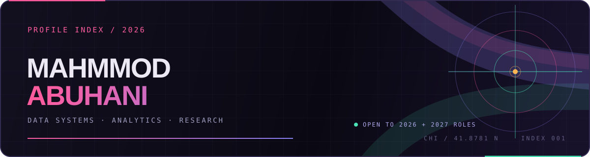

  

  <a href="https://mahmmodabuhani.github.io/"><strong>Portfolio</strong></a>
  &nbsp;&nbsp;·&nbsp;&nbsp;
  <a href="https://www.linkedin.com/in/mahmmodabuhani"><strong>LinkedIn</strong></a>
  &nbsp;&nbsp;·&nbsp;&nbsp;
  <a href="https://github.com/MahmmodAbuhani"><strong>GitHub</strong></a>

I am a Data Science student at Lake Forest College. I build practical analytics and data systems for business and operational decisions, with particular attention to the work behind a credible result: defining the question, checking the data, documenting assumptions, and making the evidence understandable to someone who did not build it.

### Index

`01` [Currently seeking](#01--currently-seeking) &nbsp; `02` [Selected work](#02--selected-work) &nbsp; `03` [Contact](#03--contact) &nbsp; `04` [Work authorization](#04--work-authorization) &nbsp; `05` [Public boundary](#05--public-boundary)

---

## 01 / Currently seeking

I am seeking **2026 and 2027 internships** in data analytics, business intelligence, reporting, and research operations.

The best fit is a team where careful data preparation, SQL or Python analysis, and clear communication support an actual decision.

---

## 02 / Selected work

<table>
  <tr>
    <td width="72" align="center"><code>01</code></td>
    <td>
      <strong>Club Operations System</strong> 
      PHP · MYSQL · RELATIONAL INTEGRITY · CONCURRENCY  
      A local PHP/MySQL reference system for a fictional sports program, with role-aware workflows, SQL integrity rules, synchronized contention tests, and a static GitHub Pages evidence walkthrough.  
      <a href="https://mahmmodabuhani.github.io/club-operations-system/"><strong>Open the static walkthrough ↗</strong></a>
      &nbsp;·&nbsp;
      <a href="https://github.com/MahmmodAbuhani/club-operations-system">Inspect the repository</a>
    </td>
  </tr>
  <tr>
    <td width="72" align="center"><code>02</code></td>
    <td>
      <strong>Machine Learning Notebook Portfolio</strong> 
      PYTHON · SCIKIT-LEARN · JUPYTER · STREAMLIT  
      A public, reproducible classical-ML portfolio with a leakage-aware Bank Marketing case study, seven notebooks, model cards, browser parity checks, and a hosted Penguins demo.  
      <a href="https://ml-notebooks-portfolio-public.streamlit.app/"><strong>Open the live demo ↗</strong></a>
      &nbsp;·&nbsp;
      <a href="https://github.com/MahmmodAbuhani/applied-ml-notebooks">Inspect the repository</a>
    </td>
  </tr>
  <tr>
    <td width="72" align="center"><code>03</code></td>
    <td>
      <strong>La Façade Ideas Portal</strong> 
      EDITORIAL WEB · INFORMATION HIERARCHY · ACCESSIBLE NAVIGATION  
      A public, account-free editorial portal focused on clear hierarchy, readable navigation, and the visitor-facing experience.  
      <a href="https://mahmmodabuhani.github.io/la-facade-ideas-portal/"><strong>Open the portal ↗</strong></a>
      &nbsp;·&nbsp;
      <a href="https://github.com/MahmmodAbuhani/la-facade-ideas-portal">Inspect the repository</a>
    </td>
  </tr>
  <tr>
    <td width="72" align="center"><code>04</code></td>
    <td>
      <strong>Portfolio Source</strong> 
      PROJECT ROUTES · WRITING · PUBLIC PROOF  
      The source behind my public portfolio, where project context and writing can carry more detail than a profile README should.  
      <a href="https://mahmmodabuhani.github.io/"><strong>Visit the portfolio ↗</strong></a>
      &nbsp;·&nbsp;
      <a href="https://github.com/MahmmodAbuhani/mahmmodabuhani.github.io">Inspect the repository</a>
    </td>
  </tr>
</table>

---

## 03 / Contact

For professional conversations, [LinkedIn](https://www.linkedin.com/in/mahmmodabuhani) is the best public contact route. My [portfolio](https://mahmmodabuhani.github.io/) carries the fuller visual story, while [GitHub](https://github.com/MahmmodAbuhani) is the source index.

---

## 04 / Work authorization

> **Work authorization: F-1 CPT and OPT only.** 
> Role-specific timing and requirements must be confirmed through the applicable school and employer process. This is a status note, not immigration advice.

---

## 05 / Public boundary

Coursework, demos, proposals, and synthetic evidence are labeled as such. I do not present local checks as hosted results, classroom-scale machine learning as production deployment, or portfolio work as real-world business impact.

PROFILE INDEX / CHICAGO / 2026

